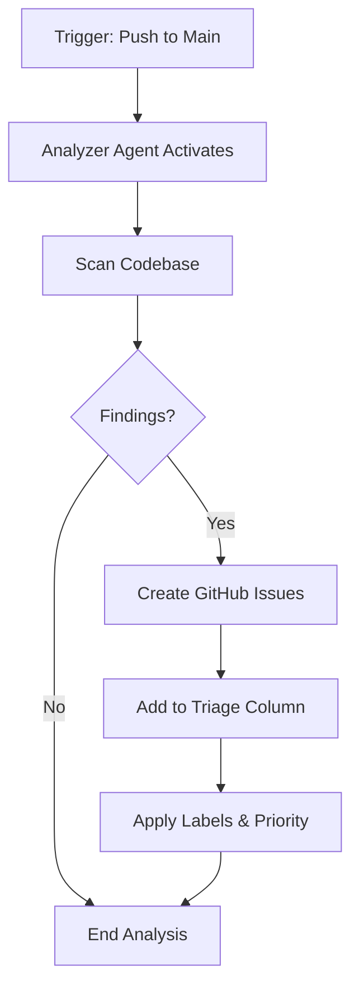
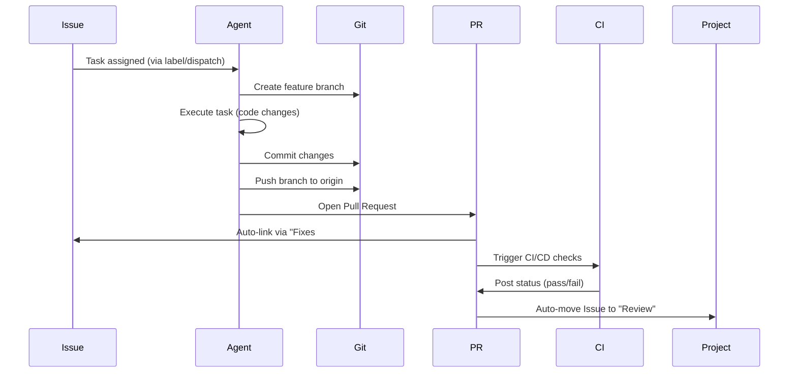
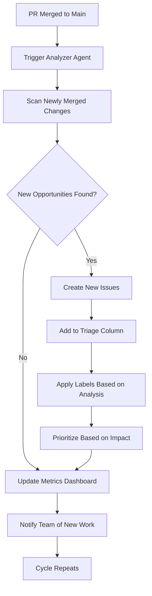
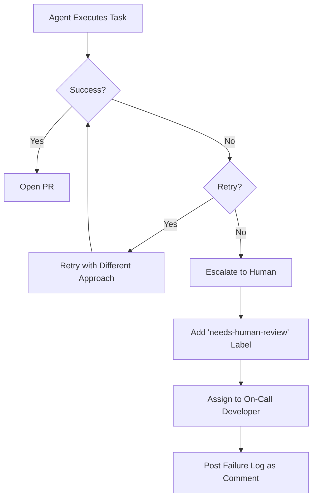
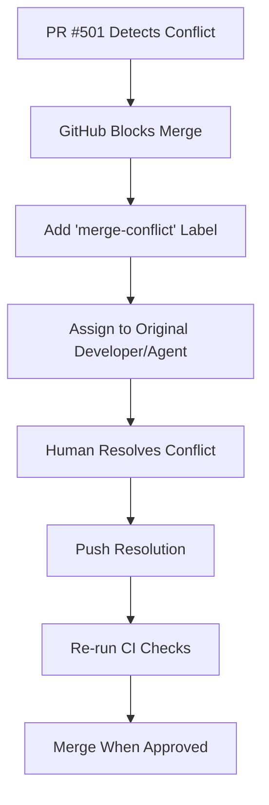

# Blueprint: The Autonomous, Generative Development Pipeline

## Document Control
- **Version**: 1.0
- **Date**: November 4, 2025
- **Architect**: AI Workflow Architect & Senior DevOps Strategist
- **Purpose**: Conceptual design for a self-perpetuating CI/CD pipeline with autonomous agent orchestration

---

## Table of Contents
1. [Executive Summary](#executive-summary)
2. [Core Components & Agent Roles](#core-components--agent-roles)
3. [The Data Model (Source of Truth)](#the-data-model-source-of-truth)
4. [The Autonomous Workflow (Step-by-Step)](#the-autonomous-workflow-step-by-step)
5. [Key Agent Interactions & Handoffs](#key-agent-interactions--handoffs)
6. [Workflow Scenarios & Bottlenecks](#workflow-scenarios--bottlenecks)
7. [Implementation Considerations](#implementation-considerations)
8. [Appendices](#appendices)

---

## Executive Summary

This blueprint describes a **generative CI/CD pipeline** where autonomous agents not only execute development tasks but also analyze the results of their work to generate the next cycle of improvements. Unlike traditional CI/CD pipelines that require human-defined backlogs, this system creates its own work queue by continuously analyzing the codebase for opportunities: missing tests, documentation gaps, tech debt, refactoring opportunities, and TODO comments.

### Key Innovation: The Feedback Loop
The critical differentiator is **Phase 4: The Generative Feedback Loop**. When an agent completes a task and merges code, the system automatically triggers an "Analyzer Agent" that scans the newly merged changes to identify follow-up work. This creates a self-perpetuating cycle of continuous improvement.

### Design Philosophy
- **GitHub as Single Source of Truth**: All work is tracked as GitHub Issues in GitHub Projects
- **Agent Specialization**: Each agent (Jules, Aider, Copilot, Web Browser) handles tasks suited to its capabilities
- **Event-Driven Architecture**: GitHub Actions orchestrate the pipeline based on issue labels and project board movements
- **Safe Autonomy**: Human review gates (PR approval) maintain quality while maximizing automation
- **Traceability**: Every action links back to an Issue, every Issue links to PRs, creating an audit trail

---

## Core Components & Agent Roles

### 1. GitHub (The Central Nervous System)

#### GitHub Issues
- **Role**: The fundamental, atomic unit of work
- **Capabilities**:
  - Hierarchical breakdown via sub-issues and task lists
  - Rich metadata (labels, assignees, milestones, custom fields)
  - Issue templates ensure consistency
  - Automatic linking to PRs via "Fixes #123" keywords
- **Usage Pattern**: Every task, bug, feature request, or improvement opportunity becomes an Issue

#### GitHub Projects
- **Role**: The flexible planning board and workflow visualization
- **Capabilities**:
  - Multiple views (Table, Kanban Board, Timeline/Roadmap)
  - Custom fields (up to 50 per project)
  - Automation workflows (auto-add issues, update status on PR merge)
  - Cross-repository support
- **Usage Pattern**: Issues flow through project columns (Triage → Ready-for-Agent → In-Progress → Review → Done)

#### GitHub Actions
- **Role**: The automation engine and event router
- **Capabilities**:
  - Trigger on any GitHub event (push, PR, issue_labeled, project_card_moved)
  - Execute workflows in containerized runners
  - Call external APIs and CLIs
  - Post comments, create issues, update project boards
- **Usage Pattern**: Detects workflow triggers and dispatches work to appropriate agents

#### GitHub Labels
- **Role**: Task categorization and routing metadata
- **Key Labels**:
  - **Task Type**: `bug`, `enhancement`, `tech-debt`, `docs`, `tests`
  - **Agent Assignment**: `jules-task`, `copilot-delegate`, `aider-interactive`, `research`
  - **Priority**: `priority:high`, `priority:medium`, `priority:low`
  - **Status**: `status:analyzing`, `status:ready`, `status:in-progress`

#### GitHub Milestones
- **Role**: Group Issues into sprints, releases, or phases
- **Usage Pattern**: Track completion percentage and due dates for collections of related work

---

### 2. Jules CLI (The Remote Executor)

#### Identity
- **Persona**: The reliable, mechanical task specialist
- **Temperament**: Deterministic, sandbox-isolated, no creative judgment

#### Capabilities
- Executes in a **secure, short-lived Ubuntu VM** with pre-configured toolchain
- Accesses **environment snapshots** ensuring reproducibility
- Ideal for **mechanical, well-defined tasks**:
  - Dependency updates (`npm update`, `pip upgrade`)
  - Running test suites and generating reports
  - Updating auto-generated documentation
  - Applying code formatters and linters
  - Simple file manipulations

#### Trigger Mechanism
```
jules remote new --session "Task description from Issue #123"
```
- Triggered by GitHub Action when Issue is labeled `jules-task`
- Jules commits work to a new branch
- Opens a PR linking back to the Issue

#### Strengths
- ✅ Isolated execution (no risk to local environment)
- ✅ Reproducible builds
- ✅ Parallel execution (multiple Jules instances can run simultaneously)
- ✅ Fast for routine maintenance tasks

#### Limitations
- ❌ No creative problem-solving
- ❌ Cannot handle ambiguous requirements
- ❌ Limited to pre-configured toolchain

---

### 3. Aider CLI (The Local Pair-Programmer)

#### Identity
- **Persona**: The thoughtful, iterative developer assistant
- **Temperament**: Exploratory, context-aware, judgment-driven

#### Capabilities
- Runs **locally in the repository context**
- **Fully Git-integrated**: commits every change with descriptive messages
- Ideal for **complex, nuanced tasks**:
  - Debugging intermittent or complex bugs
  - Refactoring large code sections
  - Implementing features with unclear requirements
  - Exploratory prototyping
  - Making architectural decisions

#### Trigger Mechanism
- Assigned to a **human developer** via Issue labeled `aider-interactive`
- Developer runs `aider` locally in interactive mode
- Aider assists with iterative code changes
- Developer reviews and commits final changes
- Opens PR linking to Issue

#### Strengths
- ✅ Deep contextual understanding
- ✅ Iterative refinement
- ✅ Human-in-the-loop for quality control
- ✅ Handles ambiguity well

#### Limitations
- ❌ Requires human guidance
- ❌ Not fully autonomous
- ❌ Slower due to iterative nature

---

### 4. Copilot CLI (The Local Orchestrator)

#### Identity
- **Persona**: The versatile general-purpose agent
- **Temperament**: Interactive, broad access, tool-agnostic

#### Capabilities
- Runs **directly in the terminal** with full filesystem access
- Can execute **any local command** (npm, node, git, docker, etc.)
- **Critical Feature**: `/delegate` command
  - Pushes work to **Copilot Coding Agent** (remote, GitHub Actions-based)
  - Coding Agent creates a branch, makes changes, opens Draft PR
  - Preserves full context from local session

#### Trigger Mechanism
**Local Mode:**
```bash
copilot
# Interactive session for general tasks
```

**Delegation Mode:**
```bash
copilot /delegate "Complete API integration tests and fix failing edge cases"
```
- Triggered by GitHub Action when Issue is labeled `copilot-delegate`
- Copilot Coding Agent runs in GitHub Actions environment
- Creates branch, commits changes, opens Draft PR
- Provides link to session logs

#### Strengths
- ✅ Broad tool access
- ✅ Can delegate to remote agent
- ✅ Preserves context across local → remote handoff
- ✅ Flexible for diverse task types

#### Limitations
- ❌ Requires approval for file-modifying tools
- ❌ Local execution limits parallelism

---

### 5. Web Browser Agent (The Researcher)

#### Identity
- **Persona**: The external knowledge specialist
- **Temperament**: Inquisitive, web-savvy, information gatherer

#### Capabilities
- **Web search and scraping** for:
  - Library version updates and changelogs
  - API documentation
  - Error message solutions
  - Best practices and patterns
  - Security vulnerability reports
- **Automated research workflows**
- **Posts findings as Issue comments**

#### Trigger Mechanism
- Assigned when Issue is labeled `research`
- GitHub Action calls browser automation tool (Playwright, Puppeteer, or Selenium)
- Searches specific queries
- Summarizes findings
- Posts comment to Issue with research results

#### Strengths
- ✅ Offloads research from developers
- ✅ Up-to-date external information
- ✅ Can validate deprecated libraries

#### Limitations
- ❌ No code execution
- ❌ Requires structured queries

---

## The Data Model (Source of Truth)

### Hierarchical Work Breakdown Structure

```
Organization/Workspace
│
├── Repositories (Code + Issues)
│   ├── Issues (Atomic Work Units)
│   │   ├── Labels (Categorization & Routing)
│   │   ├── Assignees (Ownership)
│   │   ├── Milestones (Grouping & Timeline)
│   │   ├── Sub-Issues (Hierarchical Breakdown)
│   │   └── Task Lists (Checklists)
│   │
│   └── Pull Requests
│       ├── Linked Issues (via "Fixes #N")
│       ├── Code Changes
│       └── CI/CD Status Checks
│
└── Projects (Planning Boards)
    ├── Views (Table/Board/Roadmap)
    ├── Custom Fields (Priority, Estimate, Sprint, etc.)
    └── Automation Rules
```

### GitHub Issues as the Canonical Schema

Every Issue represents a unit of work with:

```yaml
# Conceptual Issue Schema
issue:
  id: "#123"
  title: "Update authentication middleware to support OAuth2"
  body: |
    ## Context
    Current JWT-only auth limits integration options.
    
    ## Acceptance Criteria
    - [ ] Support OAuth2 flows
    - [ ] Maintain backward compatibility
    - [ ] Update documentation
    
  labels:
    - "enhancement"
    - "copilot-delegate"
    - "priority:high"
  assignee: "@copilot-agent"
  milestone: "Q4 2025 Release"
  project: "Backend Roadmap"
  linked_prs:
    - "#456"
  sub_issues:
    - "#124"  # OAuth2 flow implementation
    - "#125"  # Backward compatibility tests
    - "#126"  # Documentation updates
```

### Issue State Machine

Issues flow through defined states tracked in the GitHub Project board:

```
┌─────────┐
│ Triage  │ ◄── New issues created by Analyzer Agent or humans
└────┬────┘
     │
     ▼
┌──────────────────┐
│ Ready-for-Agent  │ ◄── Human or automation moves here after triaging
└────┬─────────────┘
     │
     ▼
┌─────────────┐
│ In-Progress │ ◄── Agent assignment triggered
└────┬────────┘
     │
     ▼
┌─────────┐
│ Review  │ ◄── PR opened and awaiting human approval
└────┬────┘
     │
     ▼
┌──────┐
│ Done │ ◄── PR merged, Issue auto-closed
└──────┘
```

### Agent Routing via Labels

The label system serves as the **routing metadata** for agent dispatch:

| Label | Target Agent | Trigger Action |
|-------|--------------|----------------|
| `jules-task` | Jules CLI | GitHub Action calls `jules remote new --session "..."` |
| `copilot-delegate` | Copilot Coding Agent | GitHub Action calls `copilot /delegate "..."` |
| `aider-interactive` | Aider CLI (Human-Assisted) | Assign to human developer |
| `research` | Web Browser Agent | GitHub Action triggers research workflow |

### Machine-Readable Plan Files (Optional Enhancement)

For advanced planning, the system can maintain **structured plan files**:

```yaml
# .github/phase_plan.yaml
epics:
  - id: "epic-001"
    title: "Implement OAuth2 Authentication"
    status: "in-progress"
    stories:
      - id: "story-001-01"
        title: "Add OAuth2 Provider Configuration"
        tasks:
          - id: "task-001-01-01"
            title: "Create OAuth2 config schema"
            github_issue: "#123"
            agent: "jules-task"
            status: "done"
          - id: "task-001-01-02"
            title: "Implement provider abstraction"
            github_issue: "#124"
            agent: "copilot-delegate"
            status: "in-progress"
```

These files are **generated from and synced with GitHub Issues** to maintain bidirectional consistency.

---

## The Autonomous Workflow (Step-by-Step)

### Phase 1: Generative Planning & Triage (The Codebase Analysis)

#### Trigger Events
1. **Scheduled**: Runs daily or on a cron schedule (e.g., midnight UTC)
2. **On Push to Main**: Triggered after any PR merge to `main` branch
3. **Manual**: Developer can trigger via workflow dispatch

#### Analyzer Agent Composition

The Analyzer Agent is a **specialized script or GitHub Action** that leverages one or more tools:
- **Copilot CLI** for contextual code understanding
- **Static Analysis Tools**: ESLint, Pylint, SonarQube, Semgrep
- **Git history analysis**: git log, git blame
- **Documentation parsers**: Check for missing docs

#### Analysis Workflow



#### Analysis Categories

The Analyzer Agent scans for:

1. **Tech Debt**
   - Code complexity metrics (cyclomatic complexity > threshold)
   - Duplicate code blocks
   - Large functions (>50 lines)
   - Commented-out code

2. **Missing Tests**
   - Functions without unit tests
   - Low code coverage areas (<80%)
   - Untested edge cases

3. **Documentation Gaps**
   - Functions without docstrings
   - Missing README sections
   - Outdated API documentation

4. **TODO Comments**
   - Parse `# TODO:`, `// TODO:`, `<!-- TODO -->` comments
   - Extract context and convert to Issues

5. **Dependency Updates**
   - Check for outdated npm/pip packages
   - Security vulnerability alerts

6. **Code Smells**
   - Long parameter lists
   - God objects/classes
   - Feature envy

#### Issue Creation Logic

For each finding, the Analyzer Agent:

```python
# Conceptual pseudo-code
def create_issue_for_finding(finding):
    issue_data = {
        "title": finding.title,
        "body": generate_issue_body(finding),
        "labels": determine_labels(finding),
        "project": "Continuous Improvement Board",
        "column": "Triage"
    }
    
    # Check for duplicates
    if not duplicate_issue_exists(issue_data):
        github.create_issue(issue_data)
        log_to_audit_trail(issue_data)
```

#### Example Generated Issues

**Finding**: Missing Unit Tests
```markdown
Title: Add unit tests for authentication middleware

## Context
Analyzer Agent detected that `src/middleware/auth.js` has 0% test coverage.

## Files Affected
- `src/middleware/auth.js` (lines 45-120)

## Suggested Actions
- Create test file: `tests/middleware/auth.test.js`
- Cover success and failure paths
- Test edge cases (expired tokens, malformed headers)

## Acceptance Criteria
- [ ] Test coverage for auth.js reaches >90%
- [ ] All edge cases covered
- [ ] Tests pass in CI

Labels: `tests`, `jules-task`, `priority:medium`
```

#### Output of Phase 1
- **New Issues** created and added to "Triage" column
- **Audit Log** entry with timestamp, trigger, findings count
- **Notification** (optional) to team Slack/Teams channel

---

### Phase 2: Agent Dispatch & Tasking (The Work Assignment)

#### Trigger Events
1. **Human Moves Issue**: From "Triage" to "Ready-for-Agent" in Project board
2. **Automation Rule**: Auto-move issues with specific labels
3. **Priority Queue**: High-priority issues auto-escalate

#### Dispatcher Logic

The Dispatcher is a **GitHub Action** that listens for `project_card_moved` events:

```yaml
# Conceptual GitHub Action
name: Agent Dispatcher
on:
  project_card:
    types: [moved]

jobs:
  dispatch:
    runs-on: ubuntu-latest
    steps:
      - name: Check if moved to Ready-for-Agent
        if: github.event.project_card.column_name == 'Ready-for-Agent'
        run: |
          # Extract Issue data
          # Determine agent based on labels
          # Trigger appropriate workflow
```

#### Agent Selection Decision Tree

```
┌─────────────────────────────┐
│ Issue in "Ready-for-Agent"  │
└──────────┬──────────────────┘
           │
           ▼
    ┌─────────────┐
    │ Check Labels│
    └──────┬──────┘
           │
      ┌────┴────┬────────┬──────────┬────────┐
      │         │        │          │        │
      ▼         ▼        ▼          ▼        ▼
  jules-task  copilot  aider-     research  [default]
             delegate interactive            
      │         │        │          │        │
      ▼         ▼        ▼          ▼        ▼
   Jules CLI  Copilot  Assign to  Browser  Manual
   Remote     Coding   Human +   Agent    Review
   Session    Agent    Aider                Needed
```

#### Scenario 1: Jules Task Dispatch

**Issue Example**: "Update all npm dependencies"
- **Labels**: `maintenance`, `jules-task`, `priority:low`

**Dispatcher Action**:
```bash
# GitHub Action calls:
jules remote new --session "Update npm dependencies per Issue #234. Run npm update, test suite, commit changes, open PR."

# Jules execution flow:
# 1. Spins up secure Ubuntu VM
# 2. Clones repository
# 3. Runs: npm update
# 4. Runs: npm test (validates no breaking changes)
# 5. Commits: "chore: update npm dependencies (#234)"
# 6. Opens PR: "Automated: Update npm dependencies"
# 7. Links PR to Issue #234
```

**Success Criteria**:
- ✅ All tests pass
- ✅ PR opened with clean diff
- ✅ Issue automatically moves to "Review" column

**Failure Handling**:
- ❌ If tests fail: Jules posts comment to Issue with error log
- ❌ Issue moves to "Needs Human Review"
- ❌ Labels updated: Add `failed-automation`

---

#### Scenario 2: Copilot Delegate Dispatch

**Issue Example**: "Refactor utils.py to improve readability"
- **Labels**: `enhancement`, `copilot-delegate`, `priority:medium`

**Dispatcher Action**:
```bash
# GitHub Action calls:
copilot /delegate "Refactor utils.py to improve readability as specified in Issue #235. Follow PEP8 guidelines, add type hints, improve function names."

# Copilot Coding Agent execution flow:
# 1. Creates branch: feature/issue-235-refactor-utils
# 2. Analyzes utils.py
# 3. Applies refactoring:
#    - Renames ambiguous variables
#    - Adds docstrings
#    - Breaks large functions into smaller ones
#    - Adds type hints
# 4. Commits changes
# 5. Opens Draft PR
# 6. Requests review from Issue assignee
```

**Success Criteria**:
- ✅ Draft PR created
- ✅ All existing tests pass
- ✅ Code meets style guidelines
- ✅ Issue automatically moves to "Review" column

**Failure Handling**:
- ❌ If changes break tests: Mark PR as "Changes Requested"
- ❌ Post analysis to PR comments
- ❌ Suggest alternative approach

---

#### Scenario 3: Aider Interactive Assignment

**Issue Example**: "Fix complex intermittent database connection bug"
- **Labels**: `bug`, `aider-interactive`, `priority:high`

**Dispatcher Action**:
```bash
# GitHub Action:
# 1. Assigns Issue to on-call developer
# 2. Posts comment: "@developer This issue requires Aider-assisted debugging."
# 3. Moves Issue to "In-Progress"
# 4. Notifies via Slack

# Developer workflow:
# 1. Checks out new branch: bugfix/issue-236-db-connection
# 2. Runs: aider
# 3. Iterates with Aider to:
#    - Add debugging logs
#    - Reproduce issue
#    - Identify root cause
#    - Implement fix
#    - Add regression tests
# 4. Aider commits changes after each iteration
# 5. Developer reviews final changes
# 6. Opens PR linking to Issue #236
```

**Success Criteria**:
- ✅ Root cause identified and documented
- ✅ Fix implemented with tests
- ✅ PR opened with detailed explanation

---

#### Scenario 4: Research Agent Dispatch

**Issue Example**: "Find a replacement for deprecated library X"
- **Labels**: `research`, `priority:medium`

**Dispatcher Action**:
```python
# GitHub Action triggers Browser Agent:
# 1. Define research queries:
research_queries = [
    "alternatives to library X 2025",
    "library X migration guide",
    "best practices for Y in 2025"
]

# 2. Browser Agent executes:
# - Web searches
# - Scrapes documentation sites
# - Compiles results

# 3. Posts findings as Issue comment:
"""
## Research Findings

### Alternatives to Library X:
1. **Library A** (⭐ 15k stars)
   - Pros: Active maintenance, TypeScript support
   - Cons: Steeper learning curve
   - Migration effort: ~2 days

2. **Library B** (⭐ 8k stars)
   - Pros: Drop-in replacement, similar API
   - Cons: Smaller community
   - Migration effort: ~1 day

### Recommendation:
Library B for faster migration, Library A for long-term robustness.

### Next Steps:
- [ ] Prototype with Library B
- [ ] Performance benchmarks
- [ ] Create migration plan
"""
```

**Success Criteria**:
- ✅ Research findings posted
- ✅ Human reviews and makes decision
- ✅ Spawns new Issues for next steps

---

### Phase 3: Execution & PR (The Modification)

#### General Execution Flow

Regardless of which agent executes the task, the flow follows a standard pattern:



#### Branch Naming Convention

All agents follow consistent branch naming:

```
<type>/<issue-number>-<short-description>

Examples:
- feature/123-oauth2-support
- bugfix/124-db-connection-fix
- chore/125-dependency-updates
- docs/126-api-documentation
```

#### Commit Message Format

All commits follow [Conventional Commits](https://www.conventionalcommits.org/):

```
<type>(<scope>): <description> (#<issue>)

Examples:
- feat(auth): add OAuth2 provider support (#123)
- fix(db): resolve intermittent connection timeout (#124)
- chore(deps): update npm dependencies (#125)
- docs(api): add OAuth2 endpoint documentation (#126)
```

#### Pull Request Template

All PRs auto-populate from a template:

```markdown
## Related Issue
Fixes #<issue-number>

## Changes Made
- [Bullet list of changes]

## Testing
- [x] Unit tests pass
- [x] Integration tests pass
- [ ] Manual testing completed (if applicable)

## Agent
Executed by: [Jules CLI | Copilot Coding Agent | Aider + Developer]

## Checklist
- [x] Code follows style guidelines
- [x] Self-review completed
- [x] Documentation updated (if needed)
```

#### CI/CD Checks

Every PR triggers automated checks:

1. **Linting**: ESLint, Pylint, Black, Prettier
2. **Tests**: Unit, Integration, E2E
3. **Security Scans**: Snyk, CodeQL, Dependabot
4. **Coverage**: Ensure coverage doesn't decrease
5. **Build**: Verify successful build
6. **Performance**: Benchmark critical paths

#### Human Review Gate

This is the **critical safety mechanism**:

- All PRs require **human approval** before merge
- Reviewer verifies:
  - ✅ Changes align with Issue requirements
  - ✅ No unintended side effects
  - ✅ Code quality meets standards
  - ✅ Tests are comprehensive
- Reviewer can:
  - Approve → Merge
  - Request Changes → Agent revises
  - Close → Task deemed unnecessary

#### Auto-Merge Configuration

Once approved, **GitHub Auto-Merge** can be enabled:

```yaml
# .github/auto-merge-config.yml
conditions:
  - all_checks_pass: true
  - required_reviews: 1
  - branch_protection: true
  - no_merge_conflicts: true

merge_method: squash  # Creates clean history
delete_branch: true   # Cleans up after merge
```

---

### Phase 4: The Generative Feedback Loop (The "Real CI/CD")

**This is the innovation that makes the system self-perpetuating.**

#### Trigger Event

```yaml
# GitHub Action
name: Generative Feedback Loop
on:
  push:
    branches:
      - main
  pull_request:
    types: [closed]
    branches:
      - main
```

#### Post-Merge Analysis Workflow



#### Analysis Scope

The Analyzer Agent focuses on **newly merged code only**:

```bash
# Git command to get changed files in last merge
git diff HEAD~1 HEAD --name-only

# For each changed file, analyze:
# 1. New functions without tests
# 2. New public APIs without docs
# 3. New complexity hotspots
# 4. New security concerns
```

#### Example Feedback Loop

**Initial Change**: Developer merges PR #123 "Add OAuth2 support"

**Analyzer Agent Detects**:
1. **New function** `validateOAuthToken()` has no unit tests
2. **New API endpoint** `/oauth/callback` lacks documentation
3. **New dependency** `oauth2-library` has a known vulnerability
4. **TODO comment** in code: "TODO: Add rate limiting to OAuth endpoints"

**Generated Issues**:

```markdown
Issue #237: Add unit tests for validateOAuthToken()
- Labels: tests, jules-task, priority:high
- Auto-added to "Triage" column

Issue #238: Document OAuth2 callback endpoint
- Labels: docs, jules-task, priority:medium
- Auto-added to "Triage" column

Issue #239: Update oauth2-library to patched version
- Labels: security, jules-task, priority:critical
- Auto-added to "Triage" column
- Auto-moved to "Ready-for-Agent" (due to critical label)

Issue #240: Implement rate limiting for OAuth endpoints
- Labels: enhancement, copilot-delegate, priority:medium
- Auto-added to "Triage" column
```

**Result**: The system has autonomously identified **4 new units of work** based on analyzing the results of the previous task.

#### Continuous Improvement Metrics

The system tracks **generative cycle metrics**:

```yaml
# .github/metrics-dashboard.yml
metrics:
  - total_issues_generated: 147
  - total_issues_completed: 132
  - cycle_time_avg: "3.2 days"
  - test_coverage_trend: "+12% (last 30 days)"
  - tech_debt_trend: "-18% (last 30 days)"
  - automation_rate: "78% (Jules + Copilot)"
```

#### Preventing Infinite Loops

**Critical Safeguards**:

1. **Duplicate Detection**: Hash Issue content, skip if already exists
2. **Threshold Limits**: Max 10 new Issues per merge
3. **Cool-down Period**: Wait 6 hours before next analysis cycle
4. **Priority Decay**: Lower priority of repeatedly un-actioned Issues
5. **Human Oversight**: Weekly review of Triage column to close invalid Issues

#### The Self-Perpetuating Cycle

```
┌─────────────────────────────────────────────────┐
│                                                 │
│  ┌──────────┐    ┌──────────┐    ┌──────────┐ │
│  │ Analyze  │───▶│ Dispatch │───▶│ Execute  │ │
│  │ Codebase │    │ to Agent │    │ & Merge  │ │
│  └──────────┘    └──────────┘    └────┬─────┘ │
│       ▲                                 │       │
│       │                                 │       │
│       └─────────────────────────────────┘       │
│            Feedback Loop: Analyze Results       │
│                                                 │
└─────────────────────────────────────────────────┘
```

This creates a **Continuous Improvement Pipeline** where:
- Code changes generate new improvement opportunities
- Improvements are automatically dispatched to agents
- Completed improvements generate more improvements
- The system evolves toward higher quality over time

---

## Key Agent Interactions & Handoffs

### Interaction Matrix

| From | To | Handoff Mechanism | Data Passed |
|------|-----|-------------------|-------------|
| Analyzer Agent | GitHub Issues | Creates Issues via API | Finding details, suggested labels |
| GitHub Actions | Jules CLI | Command execution | Issue description, branch name |
| GitHub Actions | Copilot CLI | `/delegate` command | Issue context, requirements |
| GitHub Actions | Aider (via Human) | Issue assignment | Issue URL, priority |
| GitHub Actions | Browser Agent | API call | Research queries, target Issue |
| Any Agent | GitHub PR | Git push + PR creation | Code changes, commit messages |
| GitHub PR | GitHub Issues | Auto-link via keywords | PR number, merge status |
| Merged PR | Analyzer Agent | GitHub webhook | Commit SHA, changed files |

### Decision Logic for Agent Selection

**Input**: Issue with labels and metadata

**Output**: Agent assignment

```python
def select_agent(issue):
    """
    Decision logic for agent assignment
    """
    labels = issue.labels
    complexity = estimate_complexity(issue)
    
    # Explicit agent labels take precedence
    if 'jules-task' in labels:
        return 'jules-cli'
    if 'copilot-delegate' in labels:
        return 'copilot-coding-agent'
    if 'aider-interactive' in labels:
        return 'aider-with-human'
    if 'research' in labels:
        return 'browser-agent'
    
    # Heuristic-based assignment if no explicit label
    if issue.type == 'bug' and complexity == 'high':
        return 'aider-with-human'  # Complex bugs need human judgment
    
    if issue.type in ['maintenance', 'chore', 'deps']:
        return 'jules-cli'  # Routine tasks
    
    if issue.type in ['feature', 'enhancement'] and complexity == 'medium':
        return 'copilot-coding-agent'
    
    if issue.type == 'research':
        return 'browser-agent'
    
    # Default: requires human triage
    return 'human-review'


def estimate_complexity(issue):
    """
    Estimate task complexity
    """
    factors = {
        'files_affected': count_files_in_issue(issue),
        'has_ambiguous_requirements': contains_words(issue, ['maybe', 'possibly', 'not sure']),
        'involves_architecture': contains_words(issue, ['refactor', 'redesign', 'architecture']),
        'has_external_dependencies': check_for_external_deps(issue)
    }
    
    if sum(factors.values()) > 2:
        return 'high'
    elif sum(factors.values()) > 1:
        return 'medium'
    else:
        return 'low'
```

### Handoff Protocols

#### 1. Analyzer → Issue Creation
**Protocol**: REST API call to GitHub

```json
POST /repos/:owner/:repo/issues
{
  "title": "Add unit tests for validateOAuthToken()",
  "body": "...",
  "labels": ["tests", "jules-task", "priority:high"],
  "assignee": null
}
```

**Validation**:
- Check for duplicate Issues (hash of title + body)
- Verify labels exist in repository
- Confirm project board exists

#### 2. Dispatcher → Jules CLI
**Protocol**: Shell command execution

```bash
jules remote new \
  --session "Update npm dependencies per Issue #234" \
  --branch "chore/234-npm-updates" \
  --on-complete "open-pr"
```

**Validation**:
- Verify Jules is authenticated
- Check Issue exists and is not already in progress
- Ensure no merge conflicts on target branch

#### 3. Dispatcher → Copilot Coding Agent
**Protocol**: CLI delegation

```bash
copilot /delegate \
  "Refactor utils.py per Issue #235. Follow PEP8, add type hints." \
  --issue 235 \
  --branch "feature/235-refactor-utils"
```

**Validation**:
- Session context preserved
- GitHub token has write permissions
- Target branch doesn't already exist

#### 4. Any Agent → Pull Request
**Protocol**: Git push + GitHub API

```bash
# Step 1: Git operations
git add .
git commit -m "feat(auth): add OAuth2 support (#123)"
git push origin feature/123-oauth2-support

# Step 2: Create PR via API
POST /repos/:owner/:repo/pulls
{
  "title": "feat(auth): Add OAuth2 support",
  "body": "Fixes #123\n\n## Changes Made\n...",
  "head": "feature/123-oauth2-support",
  "base": "main"
}
```

**Validation**:
- All tests pass before push
- PR template populated correctly
- Issue linkage via "Fixes #N" syntax

#### 5. Merged PR → Analyzer Agent
**Protocol**: GitHub webhook

```json
POST /webhook/endpoint
{
  "action": "closed",
  "pull_request": {
    "merged": true,
    "merge_commit_sha": "abc123",
    "base": {"ref": "main"}
  }
}
```

**Validation**:
- PR was actually merged (not just closed)
- Merge to protected branch (main)
- All status checks passed

### Error Handling & Escalation

#### Agent Failure Scenarios



#### Escalation Rules

| Failure Type | Escalation Action |
|--------------|-------------------|
| Tests fail after agent changes | Add `tests-failing` label, assign to Issue creator |
| Merge conflict detected | Add `merge-conflict` label, assign to developer |
| Agent times out (>30 min) | Cancel job, add `timeout` label, retry once |
| Security scan fails | Add `security-issue` label, escalate to security team |
| Agent produces no changes | Add `needs-clarification` label, request Issue refinement |

---

## Workflow Scenarios & Bottlenecks

### Scenario 1: Jules Task Failure

**Situation**: Jules attempts to update npm dependencies, but tests fail.

**Flow**:
1. Jules runs `npm update`
2. Jules runs `npm test`
3. Tests fail with error: `TypeError: Cannot read property 'user' of undefined`
4. Jules detects failure
5. Jules posts comment to Issue #234:
   ```
   ❌ Automated task failed
   
   **Error**: Tests failed after dependency update
   
   **Details**:
   ```
   TypeError: Cannot read property 'user' of undefined
       at AuthMiddleware.validateToken (src/middleware/auth.js:45)
   ```
   
   **Recommendation**: This requires human investigation. The updated library may have breaking changes.
   ```
6. Jules updates Issue labels: `jules-task` → `failed-automation`, `needs-human-review`
7. Jules moves Issue to "Needs Human Review" column
8. GitHub Action assigns Issue to on-call developer

**Resolution**:
- Developer investigates breaking change
- Developer fixes compatibility
- Developer re-labels as `jules-task` after fix
- Dispatcher retries

**Bottleneck Mitigation**:
- Implement pre-flight checks: Jules runs tests before attempting update
- Maintain compatibility matrix for known breaking changes
- Use semantic versioning constraints (only patch updates)

---

### Scenario 2: Duplicate Issue Creation

**Situation**: Analyzer Agent creates duplicate Issues.

**Flow**:
1. PR #123 merges, adding OAuth2 support
2. Analyzer Agent scans changes
3. Finds missing tests for `validateOAuthToken()`
4. Creates Issue #237: "Add unit tests for validateOAuthToken()"
5. PR #124 merges (related OAuth2 work)
6. Analyzer Agent scans changes
7. Again finds missing tests for `validateOAuthToken()`
8. Attempts to create duplicate Issue

**Prevention**:
```python
def create_issue_if_not_duplicate(issue_data):
    """
    Check for duplicates before creating Issue
    """
    # Generate hash from title + key body phrases
    issue_hash = hashlib.sha256(
        (issue_data['title'] + extract_key_phrases(issue_data['body'])).encode()
    ).hexdigest()
    
    # Check against recent Issues (last 30 days)
    existing_issues = github.search_issues(
        repo=REPO,
        state='open',
        created='>30d'
    )
    
    for existing in existing_issues:
        existing_hash = compute_hash(existing)
        if issue_hash == existing_hash:
            # Add comment to existing Issue instead
            github.add_comment(existing.id, "Analyzer Agent found additional evidence for this Issue.")
            return None
    
    # No duplicate found, create new Issue
    return github.create_issue(issue_data)
```

**Resolution**:
- Implement duplicate detection via content hashing
- Link related Issues via comments
- Weekly human review of Triage column to merge duplicates

**Bottleneck Mitigation**:
- Use Issue templates with structured fields for better hashing
- Implement fuzzy matching for title similarity
- Maintain Issue creation cooldown (max 10 per hour)

---

### Scenario 3: Merge Conflict Between Parallel Agents

**Situation**: Two agents work on overlapping files simultaneously.

**Flow**:
1. Issue #240 assigned to Jules: "Update ESLint config"
2. Issue #241 assigned to Copilot: "Add new linting rules"
3. Both issues involve editing `.eslintrc.json`
4. Jules opens PR #500 first
5. Copilot opens PR #501 shortly after
6. PR #500 gets approved and merged
7. PR #501 now has merge conflicts with main

**Current Handling**:


**Prevention Strategy**:
Use **Git Worktrees + Path Claims**:

```yaml
# .github/path-claims.yml
# Agents declare which files they'll modify before execution
workstreams:
  - id: "ws-240"
    agent: "jules-cli"
    claimed_paths:
      - ".eslintrc.json"
      - "package.json"
    status: "in-progress"
  
  - id: "ws-241"
    agent: "copilot-coding-agent"
    claimed_paths:
      - ".eslintrc.json"  # CONFLICT DETECTED
      - "src/linting/**"
    status: "blocked"
```

**Resolution**:
- Dispatcher detects overlapping path claims
- Blocks ws-241 until ws-240 completes
- Queue ws-241 for execution after PR #500 merges
- Copilot retries with updated main branch

**Bottleneck Mitigation**:
- Implement **Git Worktrees** for parallel execution (each agent works in isolated directory)
- Use **scope analysis** to identify non-overlapping work
- Enforce **sequential execution** for high-conflict areas (configuration files)

---

### Scenario 4: Analyzer Agent Creates Low-Value Issues

**Situation**: Analyzer creates Issues that humans consistently close as "won't fix".

**Flow**:
1. Analyzer detects TODO comment: "TODO: Consider caching strategy"
2. Creates Issue #242: "Implement caching for API responses"
3. Developer reviews, marks as "won't fix" (caching not needed yet)
4. Pattern repeats for similar TODOs

**Problem**: Noise in Triage column, wastes human review time.

**Solution: Feedback Loop for Analyzer Training**

```python
# analyzer_feedback.py
def update_analyzer_heuristics():
    """
    Learn from closed 'won't fix' Issues
    """
    wont_fix_issues = github.search_issues(
        repo=REPO,
        label='wont-fix',
        closed='>30d'
    )
    
    # Extract patterns from rejected Issues
    rejected_patterns = extract_patterns(wont_fix_issues)
    
    # Update blocklist
    ANALYZER_BLOCKLIST.update(rejected_patterns)
    
    # Examples of learned patterns:
    # - "TODO: Consider" → often aspirational, not actionable
    # - "TODO: Maybe" → low confidence
    # - Files in /examples/ → demo code, not production
```

**Resolution**:
- Weekly review of Triage column by human
- Mark low-value Issues with `wont-fix` label
- Automated script learns patterns from `wont-fix` Issues
- Analyzer skips similar patterns in future

**Bottleneck Mitigation**:
- Set **quality threshold** for Issue creation (confidence score > 0.7)
- Implement **priority scoring** to surface high-impact Issues
- Add **human feedback loop** to continuously improve Analyzer heuristics

---

### Scenario 5: Agent Overload & Queue Saturation

**Situation**: Analyzer generates more Issues than agents can process.

**Metrics**:
- Issue creation rate: 50 Issues/week
- Agent completion rate: 35 Issues/week
- Backlog growth: +15 Issues/week (unsustainable)

**Flow**:
1. Week 1: 100 Issues in Triage
2. Week 2: 115 Issues in Triage
3. Week 3: 130 Issues in Triage
4. System saturates, critical Issues delayed

**Solution: Dynamic Priority Queue + Rate Limiting**

```python
# priority_queue.py
class AdaptivePriorityQueue:
    def __init__(self):
        self.max_queue_size = 100
        self.priority_weights = {
            'critical': 10,
            'high': 5,
            'medium': 2,
            'low': 1
        }
    
    def should_create_issue(self, priority, current_queue_size):
        """
        Rate-limit Issue creation based on queue saturation
        """
        if current_queue_size > self.max_queue_size:
            # Only allow critical/high priority
            if priority in ['critical', 'high']:
                return True
            else:
                # Defer or discard
                return False
        return True
    
    def auto_close_stale_issues(self):
        """
        Close low-priority Issues older than 60 days
        """
        stale_issues = github.search_issues(
            repo=REPO,
            label='priority:low',
            state='open',
            updated='<60d'
        )
        for issue in stale_issues:
            github.close_issue(issue.id, comment="Auto-closed: Stale low-priority Issue")
```

**Resolution**:
- Implement **queue size limits** (max 100 open Issues)
- **Priority-based admission control**: only critical/high Issues when queue is full
- **Auto-close stale Issues**: low-priority Issues older than 60 days
- **Capacity planning**: scale agent resources (more Jules instances, Copilot workers)

**Bottleneck Mitigation**:
- Use **parallel execution** via Git Worktrees (multiple Jules/Copilot instances)
- Implement **agent load balancing** (distribute tasks across multiple worker pools)
- Add **human override** (emergency brake on Analyzer during overload)

---

## Implementation Considerations

### Security & Permissions

#### Agent Authentication

All agents require appropriate GitHub credentials:

```yaml
# GitHub Actions Secrets
secrets:
  GITHUB_TOKEN: ${{ secrets.GITHUB_TOKEN }}  # Built-in, scoped to repo
  JULES_API_KEY: ${{ secrets.JULES_API_KEY }}  # Jules authentication
  COPILOT_TOKEN: ${{ secrets.COPILOT_TOKEN }}  # Copilot API access
```

**Principle of Least Privilege**:
- **Jules**: Read repo, write to branches (no main access)
- **Copilot**: Read repo, write to branches (no main access)
- **Analyzer**: Read repo, write Issues (no code access)
- **Dispatcher**: Read/write Issues, trigger workflows

#### Branch Protection Rules

```yaml
# .github/branch-protection.yml
branches:
  main:
    required_reviews: 1
    required_status_checks:
      - "lint"
      - "test"
      - "security-scan"
    enforce_admins: true
    allow_force_pushes: false
    allow_deletions: false
```

This ensures:
- ✅ No agent can push directly to main
- ✅ All changes go through PR review
- ✅ Human gate preserved

#### Secrets Management

```yaml
# .github/copilot-setup-steps.yml
# For agents requiring external APIs (e.g., OAuth providers)
jobs:
  copilot-setup:
    runs-on: ubuntu-latest
    steps:
      - name: Azure Login
        uses: azure/login@v1
        with:
          client-id: ${{ secrets.AZURE_CLIENT_ID }}
          tenant-id: ${{ secrets.AZURE_TENANT_ID }}
```

---

### Monitoring & Observability

#### Dashboard Metrics

Track system health via GitHub Project Insights:

```yaml
# metrics-to-track.yml
operational_metrics:
  - issues_created_per_day: 12
  - issues_completed_per_day: 10
  - average_cycle_time: "3.2 days"
  - agent_success_rate:
      jules: 92%
      copilot: 87%
      aider: 95%
  - pr_merge_rate: 89%
  
quality_metrics:
  - test_coverage: 87%
  - code_quality_score: "A"
  - security_vulnerabilities: 2 (low severity)
  - tech_debt_ratio: "12%" (improving)

agent_performance:
  - jules_avg_execution_time: "8 minutes"
  - copilot_avg_execution_time: "15 minutes"
  - aider_avg_execution_time: "45 minutes" (human-assisted)
```

#### Alerting

```yaml
# .github/workflows/alerts.yml
name: System Health Alerts
on:
  schedule:
    - cron: '0 */6 * * *'  # Every 6 hours

jobs:
  health-check:
    runs-on: ubuntu-latest
    steps:
      - name: Check Queue Saturation
        run: |
          queue_size=$(gh issue list --state open --label "Triage" --json number | jq length)
          if [ $queue_size -gt 100 ]; then
            # Send alert to Slack
            curl -X POST $SLACK_WEBHOOK_URL \
              -d "{'text': '⚠️ Issue queue saturated: $queue_size open issues'}"
          fi
```

---

### Rollback & Disaster Recovery

#### Failed Deployment Rollback

```bash
# If a merged PR causes production issues:

# 1. Identify problematic commit
git log --oneline -10

# 2. Revert the merge commit
git revert -m 1 <merge-commit-sha>

# 3. Push revert
git push origin main

# 4. Analyzer Agent will NOT analyze reverted code
# (special marker in commit message: "revert:")
```

#### Database Backup for Issues

```yaml
# .github/workflows/backup-issues.yml
name: Backup Issues to JSON
on:
  schedule:
    - cron: '0 2 * * *'  # Daily at 2 AM

jobs:
  backup:
    runs-on: ubuntu-latest
    steps:
      - name: Export Issues
        run: |
          gh issue list --state all --json number,title,body,labels,state \
            > issues-backup-$(date +%Y%m%d).json
      
      - name: Upload to S3
        run: |
          aws s3 cp issues-backup-*.json s3://backup-bucket/issues/
```

---

### Scaling Considerations

#### Horizontal Scaling via Git Worktrees

```bash
# Simultaneously execute 5 workstreams
git worktree add /tmp/ws-1 feature/issue-240
git worktree add /tmp/ws-2 feature/issue-241
git worktree add /tmp/ws-3 feature/issue-242
git worktree add /tmp/ws-4 feature/issue-243
git worktree add /tmp/ws-5 feature/issue-244

# Each worktree runs an independent agent instance
cd /tmp/ws-1 && jules remote new --session "..." &
cd /tmp/ws-2 && copilot /delegate "..." &
cd /tmp/ws-3 && jules remote new --session "..." &
cd /tmp/ws-4 && copilot /delegate "..." &
cd /tmp/ws-5 && jules remote new --session "..." &
```

**Benefits**:
- ✅ True parallelism (5x throughput)
- ✅ Filesystem isolation (no conflicts)
- ✅ Rollback per workstream

#### Agent Pool Management

```yaml
# agent-pool-config.yml
pools:
  jules-pool:
    min_instances: 2
    max_instances: 10
    scale_metric: queue_depth
    scale_threshold: 5  # Scale up when queue > 5
  
  copilot-pool:
    min_instances: 1
    max_instances: 5
    scale_metric: queue_depth
    scale_threshold: 3
```

---

## Appendices

### Appendix A: Sample GitHub Actions Workflows

#### Analyzer Agent Workflow

```yaml
# .github/workflows/analyzer-agent.yml
name: Analyzer Agent (Generative Planning)

on:
  push:
    branches:
      - main
  schedule:
    - cron: '0 0 * * *'  # Daily at midnight
  workflow_dispatch:  # Manual trigger

jobs:
  analyze:
    runs-on: ubuntu-latest
    steps:
      - uses: actions/checkout@v3
        with:
          fetch-depth: 2  # Get last 2 commits for diff
      
      - name: Install Analysis Tools
        run: |
          pip install pylint pytest-cov semgrep
          npm install -g eslint
      
      - name: Analyze Codebase
        id: analyze
        run: |
          python .github/scripts/analyzer.py \
            --mode generative \
            --output findings.json
      
      - name: Create Issues from Findings
        env:
          GITHUB_TOKEN: ${{ secrets.GITHUB_TOKEN }}
        run: |
          python .github/scripts/create-issues.py \
            --findings findings.json \
            --project "Continuous Improvement" \
            --column "Triage"
      
      - name: Post Summary
        run: |
          echo "📊 Analysis Complete"
          echo "New Issues Created: $(jq '.issues_created' findings.json)"
```

#### Agent Dispatcher Workflow

```yaml
# .github/workflows/dispatcher.yml
name: Agent Dispatcher

on:
  project_card:
    types: [moved]
  issues:
    types: [labeled]

jobs:
  dispatch:
    runs-on: ubuntu-latest
    steps:
      - name: Parse Issue
        id: parse
        run: |
          ISSUE_NUMBER=${{ github.event.issue.number }}
          LABELS=$(gh issue view $ISSUE_NUMBER --json labels --jq '.labels[].name')
          echo "labels=$LABELS" >> $GITHUB_OUTPUT
      
      - name: Dispatch to Jules
        if: contains(steps.parse.outputs.labels, 'jules-task')
        run: |
          jules remote new \
            --session "Process Issue #${{ github.event.issue.number }}" \
            --branch "chore/${{ github.event.issue.number }}"
      
      - name: Dispatch to Copilot
        if: contains(steps.parse.outputs.labels, 'copilot-delegate')
        run: |
          copilot /delegate \
            "Complete task in Issue #${{ github.event.issue.number }}"
      
      - name: Assign to Human + Aider
        if: contains(steps.parse.outputs.labels, 'aider-interactive')
        run: |
          gh issue edit ${{ github.event.issue.number }} \
            --add-assignee "@on-call-developer"
```

---

### Appendix B: Analyzer Agent Pseudo-Implementation

```python
# .github/scripts/analyzer.py

import subprocess
import json
from typing import List, Dict

class CodebaseAnalyzer:
    def __init__(self):
        self.findings = []
    
    def analyze_new_changes(self) -> List[Dict]:
        """Analyze code changes from last merge"""
        # Get changed files
        changed_files = self._get_changed_files()
        
        for file_path in changed_files:
            self.findings.extend(self._check_missing_tests(file_path))
            self.findings.extend(self._check_missing_docs(file_path))
            self.findings.extend(self._check_complexity(file_path))
            self.findings.extend(self._extract_todos(file_path))
        
        return self.findings
    
    def _get_changed_files(self) -> List[str]:
        """Get files changed in last commit"""
        result = subprocess.run(
            ['git', 'diff', 'HEAD~1', 'HEAD', '--name-only'],
            capture_output=True, text=True
        )
        return result.stdout.strip().split('\n')
    
    def _check_missing_tests(self, file_path: str) -> List[Dict]:
        """Identify functions without tests"""
        findings = []
        
        if file_path.endswith('.py'):
            # Parse Python file for function definitions
            functions = self._extract_functions(file_path)
            test_file = file_path.replace('src/', 'tests/').replace('.py', '_test.py')
            
            if not os.path.exists(test_file):
                findings.append({
                    'type': 'missing_tests',
                    'file': file_path,
                    'description': f'No test file exists for {file_path}',
                    'suggested_labels': ['tests', 'jules-task', 'priority:high']
                })
        
        return findings
    
    def _check_missing_docs(self, file_path: str) -> List[Dict]:
        """Identify missing documentation"""
        # Check for docstrings, README sections, etc.
        pass
    
    def _check_complexity(self, file_path: str) -> List[Dict]:
        """Identify complex functions (cyclomatic complexity > 10)"""
        pass
    
    def _extract_todos(self, file_path: str) -> List[Dict]:
        """Find TODO comments and convert to Issues"""
        findings = []
        
        with open(file_path, 'r') as f:
            for line_num, line in enumerate(f, 1):
                if 'TODO:' in line:
                    todo_text = line.split('TODO:')[1].strip()
                    findings.append({
                        'type': 'todo_comment',
                        'file': file_path,
                        'line': line_num,
                        'description': todo_text,
                        'suggested_labels': ['enhancement', 'copilot-delegate', 'priority:medium']
                    })
        
        return findings

if __name__ == '__main__':
    analyzer = CodebaseAnalyzer()
    findings = analyzer.analyze_new_changes()
    
    with open('findings.json', 'w') as f:
        json.dump({'findings': findings, 'issues_created': len(findings)}, f, indent=2)
```

---

### Appendix C: Issue Creation Script

```python
# .github/scripts/create-issues.py

import json
import hashlib
from github import Github

def create_issues_from_findings(findings_file: str, github_token: str):
    """Create GitHub Issues from analysis findings"""
    
    with open(findings_file, 'r') as f:
        data = json.load(f)
        findings = data['findings']
    
    gh = Github(github_token)
    repo = gh.get_repo(REPO_NAME)
    
    for finding in findings:
        # Check for duplicates
        issue_hash = compute_hash(finding)
        if not is_duplicate(repo, issue_hash):
            issue = repo.create_issue(
                title=generate_title(finding),
                body=generate_body(finding),
                labels=finding['suggested_labels']
            )
            print(f"Created Issue #{issue.number}: {issue.title}")

def compute_hash(finding: dict) -> str:
    """Generate hash to detect duplicates"""
    content = finding['type'] + finding['file'] + finding['description']
    return hashlib.sha256(content.encode()).hexdigest()

def is_duplicate(repo, issue_hash: str) -> bool:
    """Check if Issue already exists"""
    # Search recent Issues for matching hash
    # Implementation depends on where hash is stored (label, comment, etc.)
    pass

def generate_title(finding: dict) -> str:
    """Generate Issue title from finding"""
    if finding['type'] == 'missing_tests':
        return f"Add unit tests for {finding['file']}"
    elif finding['type'] == 'todo_comment':
        return f"TODO: {finding['description'][:50]}"
    # ... other types

def generate_body(finding: dict) -> str:
    """Generate Issue body with context and acceptance criteria"""
    return f"""
## Context
Analyzer Agent detected: {finding['description']}

## Files Affected
- `{finding['file']}`

## Acceptance Criteria
- [ ] Address finding
- [ ] Update tests
- [ ] Verify CI passes

---
*Auto-generated by Analyzer Agent*
"""
```

---

### Appendix D: Key Decision Points Summary

| Decision Point | Recommendation | Rationale |
|----------------|----------------|-----------|
| Agent for routine maintenance | Jules CLI | Isolated, reproducible, fast |
| Agent for complex features | Copilot Coding Agent | Autonomous, context-aware, PR workflow |
| Agent for ambiguous bugs | Aider + Human | Requires judgment and iterative exploration |
| Agent for research | Browser Agent | Offloads external knowledge gathering |
| Issue creation frequency | Daily analysis + post-merge | Balance between freshness and noise |
| Duplicate detection method | Content hashing | Fast, deterministic |
| Merge conflict handling | Git Worktrees + Path Claims | Filesystem isolation, parallel execution |
| Queue saturation response | Priority-based admission control | Prevents backlog growth |
| Human review gate | Required for all PRs | Safety and quality assurance |
| Auto-merge conditions | Approval + All checks pass | Reduces manual toil |

---

### Appendix E: Glossary

- **Analyzer Agent**: Automated system that scans codebase for improvement opportunities and creates Issues
- **Dispatcher**: GitHub Action that routes Issues to appropriate agents based on labels
- **Generative Feedback Loop**: Post-merge analysis that creates new Issues based on completed work
- **Git Worktree**: Separate working directory for a branch, enabling parallel execution
- **Issue State Machine**: Defined flow of Issue status (Triage → Ready → In-Progress → Review → Done)
- **Path Claims**: Agent declaration of which files will be modified, preventing conflicts
- **Priority Queue**: Ordered backlog where high-priority Issues are processed first
- **Agent Pool**: Collection of worker instances (Jules/Copilot) that can execute tasks in parallel
- **Cycle Time**: Time from Issue creation to PR merge
- **Throughput**: Number of Issues completed per time period

---

### Appendix F: Next Steps for Implementation

1. **Phase 1: Foundation (Weeks 1-2)**
   - Set up GitHub Project board with columns
   - Define label taxonomy
   - Create Issue templates
   - Implement basic GitHub Actions (dispatcher)

2. **Phase 2: Agent Integration (Weeks 3-4)**
   - Connect Jules CLI to dispatcher
   - Connect Copilot CLI to dispatcher
   - Configure branch protection rules
   - Test manual agent assignment

3. **Phase 3: Analyzer Agent (Weeks 5-6)**
   - Build codebase analysis scripts
   - Implement TODO extraction
   - Create Issue creation automation
   - Test post-merge trigger

4. **Phase 4: Feedback Loop (Weeks 7-8)**
   - Implement duplicate detection
   - Configure generative cycle
   - Add rate limiting
   - Monitor queue metrics

5. **Phase 5: Optimization (Weeks 9-10)**
   - Implement Git Worktrees for parallelism
   - Add priority-based queuing
   - Configure auto-merge
   - Set up alerting and dashboards

6. **Phase 6: Stabilization (Weeks 11-12)**
   - Tune analyzer heuristics
   - Refine agent selection logic
   - Document runbooks
   - Train team on system

---

## Conclusion

This blueprint describes a **self-perpetuating, generative development pipeline** that:

✅ **Autonomously identifies work** via codebase analysis  
✅ **Intelligently routes tasks** to specialized agents  
✅ **Executes modifications** with safety gates  
✅ **Generates new improvements** from completed work  
✅ **Scales horizontally** via Git Worktrees and agent pools  
✅ **Maintains human oversight** through PR review gates  

The system creates a **Continuous Improvement Loop** where:
1. Code changes are analyzed for opportunities
2. Opportunities become Issues
3. Issues are dispatched to agents
4. Agents complete work and open PRs
5. PRs are reviewed and merged
6. Merged changes trigger new analysis
7. **The cycle repeats indefinitely**

This represents a paradigm shift from **manual backlog management** to **autonomous backlog generation**, enabling development teams to focus on high-value work while the system handles continuous improvement.

---

**End of Blueprint**

*Version 1.0 | November 4, 2025*
