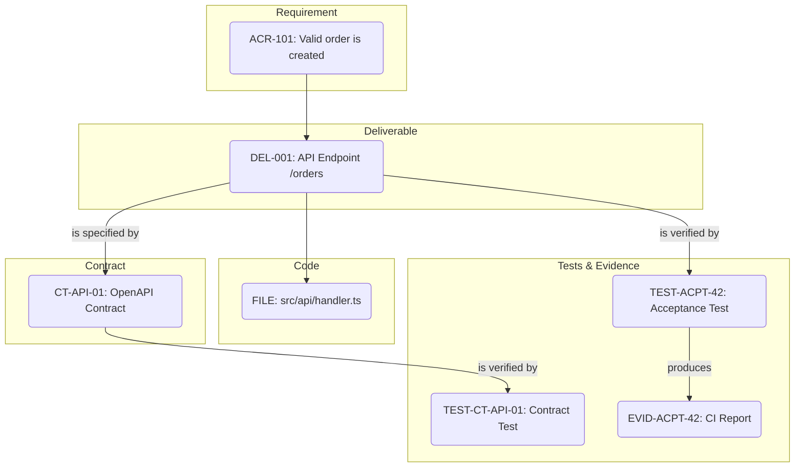

```mermaid
graph TD
    subgraph "Requirement"
        ACR_101("ACR-101: Valid order is created")
    end

    subgraph "Deliverable"
        DEL_001("DEL-001: API Endpoint /orders")
    end
    
    subgraph "Contract"
        CT_API("CT-API-01: OpenAPI Contract")
    end

    subgraph "Code"
        FILE_handler("FILE: src/api/handler.ts")
    end

    subgraph "Tests & Evidence"
        TEST_ACPT("TEST-ACPT-42: Acceptance Test")
        TEST_CT("TEST-CT-API-01: Contract Test")
        EVID_ACPT("EVID-ACPT-42: CI Report")
    end

    ACR_101 --> DEL_001
    DEL_001 --> FILE_handler
    DEL_001 -- "is verified by" --> TEST_ACPT
    DEL_001 -- "is specified by" --> CT_API
    CT_API -- "is verified by" --> TEST_CT
    TEST_ACPT -- "produces" --> EVID_ACPT
```
